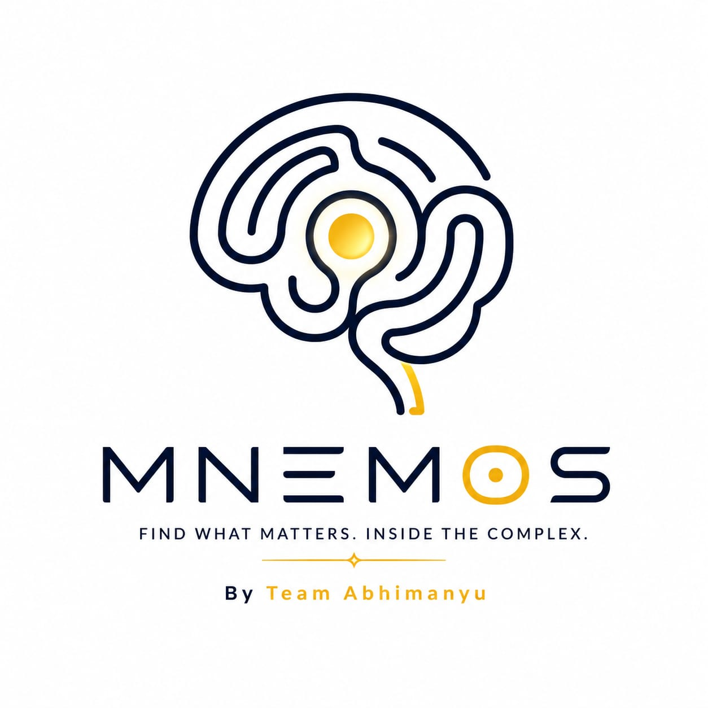

# 🧠 MnemOS

### *FIND WHAT MATTERS, INSIDE THE COMPLEX.*

<p align="center">
  
</p>

<p align="center">
  <strong>An AI-Powered Memory Operating System that transforms digital activity into a persistent Learning Twin.</strong>
</p>

<p align="center">
  
  
  
  
  
</p>

---

# 🚀 What is MnemOS?

Every day we browse hundreds of websites, articles, videos, tutorials and documentation pages.

Most of that knowledge is forgotten.

**MnemOS** acts as a personal Memory Operating System that continuously learns from your digital activity and builds an intelligent **Learning Twin** that remembers what you've learned, identifies your interests, tracks your growth, and provides personalized AI-powered insights.

Instead of searching through browser history, bookmarks, notes and tabs, users can simply ask:

> *"What have I been learning recently?"*

And MnemOS remembers.

---

# ✨ Key Features

## 🧠 Learning Twin

Creates a dynamic AI representation of the user based on:

* Learning behavior
* Topics explored
* Skills developed
* Research interests
* Knowledge growth

---

## 🌐 Browser Memory Capture

Chrome Extension automatically captures:

* Learning websites
* Documentation pages
* Tutorials
* Technical articles
* Research activity

without interrupting the user's workflow.

---

## 💬 AI Memory Assistant

Ask natural language questions like:

* What have I been learning recently?
* What are my strongest skills?
* What topics do I spend most time researching?
* What career paths match my learning behavior?

---

## 📈 Skill Intelligence

Automatically detects:

* Skill trends
* Learning patterns
* Knowledge depth
* Growth trajectory

---

## 🎯 Career Insights

Uses accumulated learning history to generate:

* Career recommendations
* Skill gap analysis
* Learning roadmaps
* Growth opportunities

---

## ⏳ Learning Timeline

Visualize:

* Learning evolution
* Knowledge accumulation
* Research patterns
* Progress over time

---

# 🏗 System Architecture

```text
Chrome Extension
        │
        ▼
 Memory Collection
        │
        ▼
 Node.js Backend API
        │
        ▼
 SQLite Memory Store
        │
        ▼
 Gemini 2.5 Flash
        │
        ▼
 Learning Twin Engine
        │
        ▼
 React Dashboard
```

# 🛠 Tech Stack

### Frontend

* React 19
* TypeScript
* Vite
* Tailwind CSS
* Framer Motion
* Recharts

### Backend

* Node.js
* Express.js
* SQLite

### AI Layer

* Google Gemini 2.5 Flash

### Browser Extension

* Chrome Extension (Manifest V3)

### Deployment

* Vercel
* Render

---

# 📂 Project Structure

```text
MnemOS
│
├── frontend/
│   ├── src/
│   ├── public/
│   └── components/
│
├── backend/
│   ├── server.js
│   ├── database.js
│   ├── keyManager.js
│   ├── mnemosService.js
│   └── database.db
│
├── MnemOS extension/
│   ├── manifest.json
│   ├── background.js
│   └── assets/
│
└── README.md
```

---

# ⚙️ Installation

## Clone Repository

```bash
git clone https://github.com/your-repository/MnemOS.git

cd MnemOS
```

## Backend Setup

```bash
cd backend

npm install
```

Create `.env`

```env
GOOGLE_API_KEY_1=YOUR_GEMINI_KEY
```

Start backend:

```bash
node server.js
```

---

## Frontend Setup

```bash
cd frontend

npm install

npm run dev
```

---

# 🌍 Deployment

## Backend (Render)

Environment Variables:

```env
GOOGLE_API_KEY_1=YOUR_KEY
```

Start Command:

```bash
node server.js
```

---

## Frontend (Vercel)

Environment Variable:

```env
VITE_API_URL=https://your-render-url/api
```

Root Directory:

```text
frontend
```

Framework:

```text
Vite
```

---

# 🔐 Security

⚠️ Never commit:

* API Keys
* .env files
* Database credentials

Store secrets only inside deployment platform environment variables.

---

# 🔮 Future Roadmap

* Semantic Memory Search
* Vector Database Integration
* Multi-Browser Support
* Personalized Learning Recommendations
* Collaborative Knowledge Graphs
* Mobile Application
* Real-Time Learning Analytics

---

# 🏆 Built For

Hackathons • Students • Researchers • Developers • Lifelong Learners

---

# 👥 Team Abhimanyu

### MnemOS

*"A Memory Operating System for the AI Age."*

Built with ❤️ by Team Abhimanyu.
